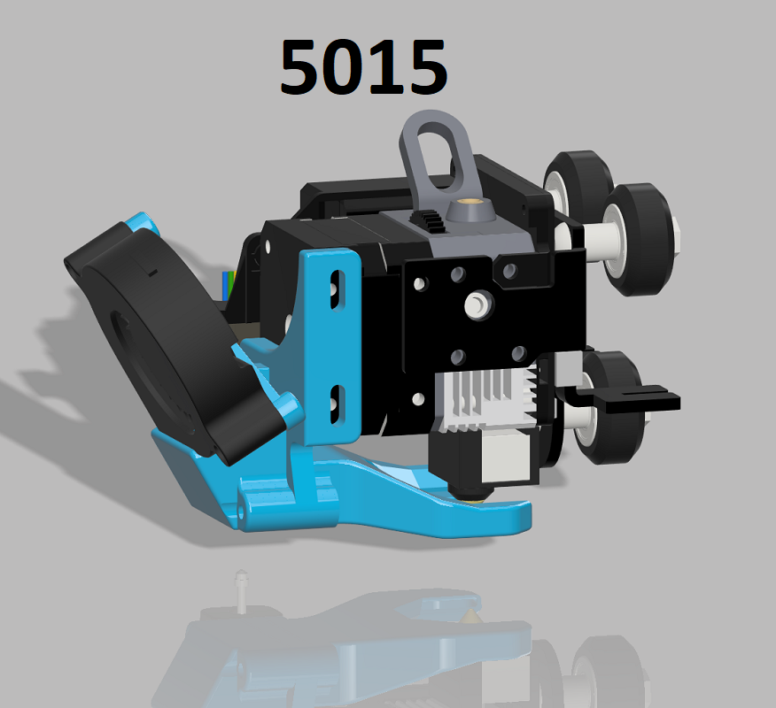
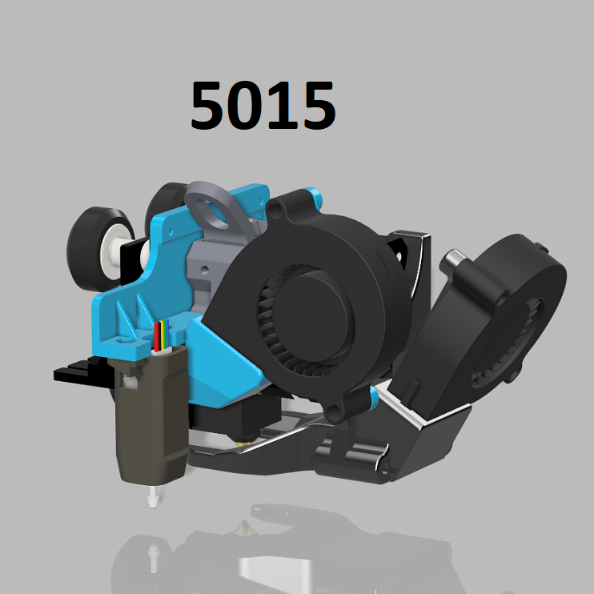

# Ender 3 S1

## Required slicer configuration

Since I use PrusaSlicer the following config snippets are only tested on that, but should be fairly easy to adapt to the slicer of your choosing.

### Start GCODE

```
M190 S0; don't set bed temperature
M104 S0; don't set extruder temperature
START_PRINT BED={first_layer_bed_temperature[0]} EXTRUDER={first_layer_temperature[0]}
```

### End GCODE

```
END_PRINT
```

## Modifications

Even though I am trying to keep this printer as close to stock as possible, we all know that is pretty much impossible :P

### Print head

I have made the following changes to the stock print head:

- Creality 3D Heating Block Kit - High Temperature Pro (300℃) ([Creality store link](https://www.creality3dshop.eu/products/creality3d-heating-block-kit-high-temperature-pro-300-for-ender-3-s1-ender-3-s1-pro-cr-10-smart-pro-sermoon-v1-sermoon-v1-pro-hot-end))
- Brozzl Mk8 Copper plated 0.6mm nozzle ([3DJake link](https://www.3djake.com/brozzl/mk8-nozzle-copper-plated?sai=6179))

### Part cooling



I have replaced the stock part cooling fan with a GDSTIME 5015 24v blower fan. ([Amazon link](https://www.amazon.de/gp/product/B08QJ5C5PS))

In order to mount this I have purchased and installed V3 of this fan system by [Zuff](https://cults3d.com/en/users/Zuff): https://cults3d.com/en/3d-model/tool/air-duct-5015-ender-3-s1-pro-v3

### Hotend cooling



I have replaced the stock hotend cooling fan with a GDSTIME 5015 24v blower fan. ([Amazon link](https://www.amazon.de/gp/product/B08QJ5C5PS))

In order to mount this I have purchased and installed this support plate by [Zuff](https://cults3d.com/en/users/Zuff): https://cults3d.com/en/3d-model/tool/ender-3-s1-pro-4020-fan-cr-touch-no-y-offset. This has the additional benefit of removing the Y offset for the CR-Touch allowing it to reach more of the bed.
